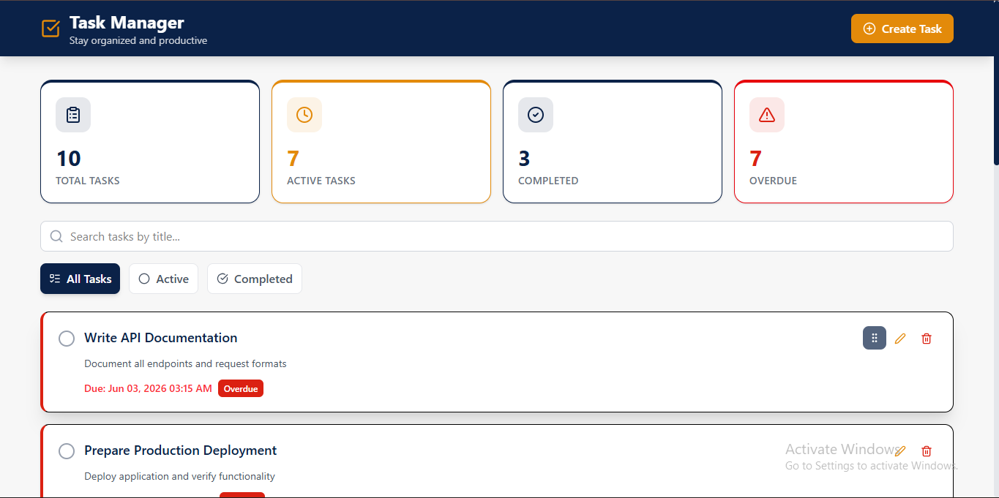
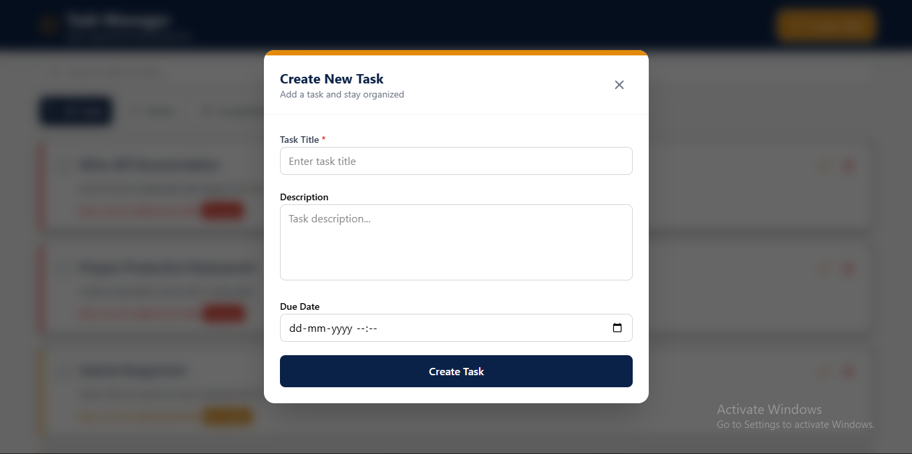
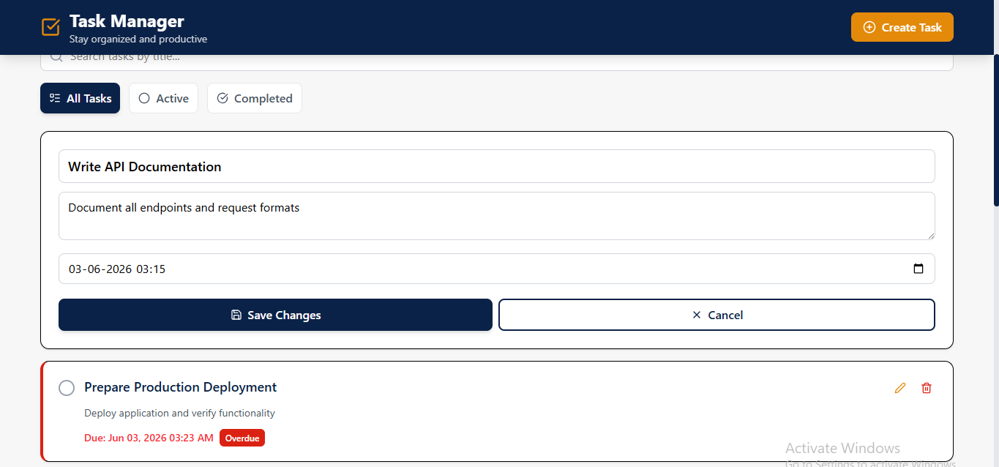
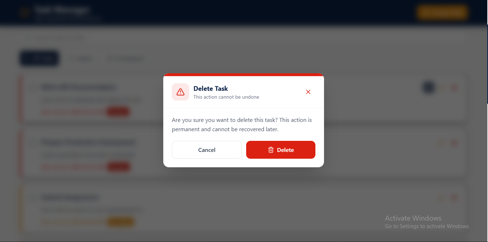

# Personal Task Manager

A modern full-stack task management application built with React, Node.js, Express, and MongoDB. This project was developed as part of the **Studio Graphene Full Stack Developer Assessment (Exercise 1 - Personal Task Manager)**. The application allows users to create, manage, organize, and track personal tasks efficiently with a clean and responsive user interface. It supports task creation, editing, deletion, filtering, searching, drag-and-drop reordering, overdue task highlighting, and real-time task statistics. 

---

## Live Demo

### Frontend

```bash
https://personal-task-manager-frontend-g3bb.onrender.com
```

### Backend API

```bash
https://personal-task-manager-backend-gypf.onrender.com
```

---

# Application Preview

## Main Dashboard

The central workspace where users can view, manage, search, filter, and organize all tasks.



---

## Create Task

Users can create a new task by providing a title, optional description, and due date.



---

## Edit Task

Existing tasks can be updated seamlessly through an intuitive edit modal.



---

## Delete Confirmation

A confirmation dialog prevents accidental task deletion and improves user experience.



---

# Features

## Core Features

Create Tasks

* Title (Required)
* Description (Optional)
* Due Date (Optional)

View Tasks

* Sorted by newest first
* Responsive card layout

Update Tasks

* Edit title
* Edit description
* Edit due date

Delete Tasks

* Confirmation modal before deletion

Toggle Status

* Mark Complete
* Mark Incomplete

Task Filtering

* All Tasks
* Active Tasks
* Completed Tasks

## Additional Features

Search Tasks by Title

Active & Completed Statistics

Overdue Task Detection

Drag and Drop Task Reordering

Loading States

Empty State UI

Error Handling

Responsive Design

---

# Tech Stack

## Frontend

| Technology        | Purpose                   |
| ----------------- | ------------------------- |
| React             | UI Development            |
| Vite              | Fast Build Tool           |
| Axios             | API Communication         |
| React Hooks       | State Management          |
| @hello-pangea/dnd | Drag & Drop Functionality |
| Lucide React      | Icons                     |
| Tailwind CS       | Styling                   |

## Backend

| Technology | Purpose               |
| ---------- | --------------------- |
| Node.js    | Runtime               |
| Express.js | REST API              |
| MongoDB    | Database              |
| Mongoose   | ODM                   |
| dotenv     | Environment Variables |
| cors       | Cross-Origin Requests |

---

# Project Structure

```bash
personal-task-manager
│
├── client
│   └── src
│       ├── assets
│       │   ├── hero.png
│       │   ├── react.svg
│       │   └── vite.svg
│       │
│       ├── components
│       │   ├── common
│       │   │   ├── Header.jsx
│       │   │   ├── Loader.jsx
│       │   │   └── EmptyState.jsx
│       │   │
│       │   ├── filters
│       │   │   ├── SearchBar.jsx
│       │   │   ├── FilterBar.jsx
│       │   │   └── StatsSection.jsx
│       │   │
│       │   └── task
│       │       ├── TaskCard.jsx
│       │       ├── TaskList.jsx
│       │       ├── TaskForm.jsx
│       │       ├── TaskModal.jsx
│       │       └── DeleteConfirmationModal.jsx
│       │
│       ├── hooks
│       │   └── useTasks.jsx
│       │
│       ├── services
│       │   └── api.js
│       │
│       ├── styles
│       │   ├── App.css
│       │   └── index.css
│       │
│       ├── App.jsx
│       └── main.jsx
│
└── server
    ├── config
    │   └── database.js
    │
    ├── controllers
    │   └── taskController.js
    │
    ├── middleware
    │   └── errorHandler.js
    │
    ├── models
    │   └── Task.js
    │
    ├── routes
    │   └── taskRoutes.js
    │
    └── app.js
```

---

# Installation & Setup

## Prerequisites

* Node.js v18+
* npm
* MongoDB Atlas / Local MongoDB

---

## Clone Repository

```bash
git clone https://github.com/ujjwalkumarsahni/personal-task-manager.git

cd personal-task-manager
```

---

## Backend Setup

```bash
cd server

npm install
```

### Create .env

```env
PORT=5000

MONGODB_URI=your_mongodb_connection_string
```

### Run Backend

```bash
npm run dev
```

Backend will run at:

```bash
http://localhost:5000
```

---

## Frontend Setup

```bash
cd client

npm install
```

### Create .env

```env
VITE_API_URL=http://localhost:5000/api
```

### Run Frontend

```bash
npm run dev
```

Frontend will run at:

```bash
http://localhost:5173
```

---

# API Documentation

## Base URL

```bash
/api/tasks
```

---

## 1. Get All Tasks

### Request

```http
GET /api/tasks
```

### Response

```json
[
  {
    "_id": "665a12345",
    "title": "Complete Assignment",
    "description": "Finish Studio Graphene Assessment",
    "dueDate": "2025-06-10",
    "completed": false,
    "createdAt": "2025-06-05T10:00:00Z"
  }
]
```

---

## 2. Create Task

### Request

```http
POST /api/tasks
```

### Body

```json
{
  "title": "Build Task Manager",
  "description": "Finish Full Stack Project",
  "dueDate": "2025-06-10"
}
```

### Response

```json
{
  "success": true,
  "task": {}
}
```

---

## 3. Update Task

### Request

```http
PUT /api/tasks/:id
```

### Body

```json
{
  "title": "Updated Title",
  "completed": true
}
```

### Response

```json
{
  "success": true,
  "task": {}
}
```

---

## 4. Toggle Task Status

### Request

```http
PATCH /api/tasks/:id/toggle
```

### Response

```json
{
  "success": true,
  "task": {}
}
```

---

## 5. Delete Task

### Request

```http
DELETE /api/tasks/:id
```

### Response

```json
{
  "success": true,
  "message": "Task deleted successfully"
}
```

---

# Testing Checklist

### Functional Testing

* [x] Create Task
* [x] Edit Task
* [x] Delete Task
* [x] Toggle Completion
* [x] Search Tasks
* [x] Filter Tasks
* [x] Drag & Drop
* [x] Responsive Design
* [x] API Error Handling

### Manual API Testing

Tested using:

* Postman
* Browser UI

---

# Error Handling

Implemented:

* Global Error Middleware
* API Validation
* Invalid MongoDB ID Handling
* Empty Form Validation
* Loading & Empty States

---

# Future Improvements

Given additional time, I would implement:

### Authentication

* JWT Authentication
* User Registration/Login

### Productivity Features

* Task Categories
* Task Priority Levels
* Task Reminders
* Recurring Tasks

### Advanced Features

* Dark Mode
* Activity Logs
* Notifications
* Team Collaboration

### Performance

* Pagination
* Caching
* Optimistic UI Updates

### Testing

* Unit Testing
* Integration Testing
* End-to-End Testing

---

# Acknowledgements

This project was developed as part of the **Studio Graphene Full Stack Developer Assessment – Exercise 1: Personal Task Manager**. The goal was to build a complete full-stack CRUD application with a clean architecture, responsive UI, and proper documentation. 

---

## Author

**Ujjwal Kumar**

GitHub: `https://github.com/ujjwalkumarsahni`

LinkedIn: `https://linkedin.com/in/ujjwalkumarsahni`

Email: `ujjwalkumar0514@gmail.com`

---

### Reviewer Notes

* All mandatory requirements from the assessment have been implemented.
* Additional bonus features include Search, Drag & Drop Reordering, Enhanced Statistics, and Overdue Task Highlighting.
* Project follows a scalable folder structure and separation of concerns between frontend and backend. 

